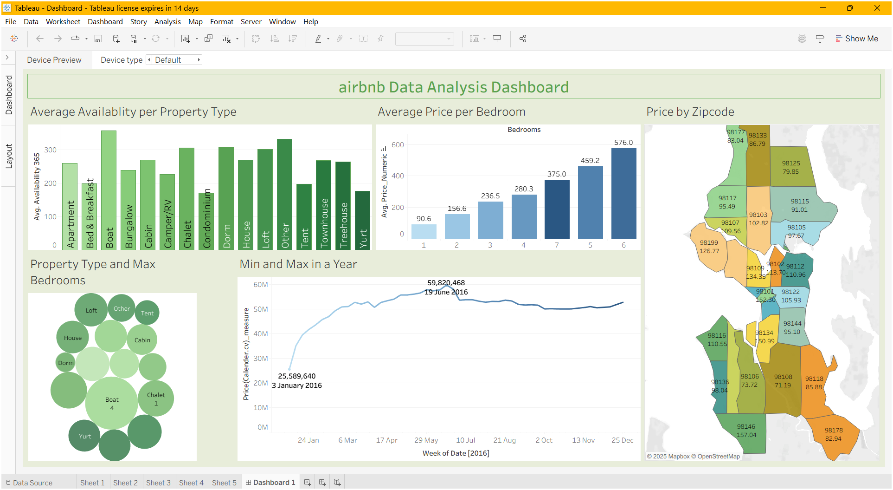

# Airbnb Data Analysis Dashboard – Tableau

## Project Overview
This project performs an in-depth analysis of the Airbnb 2016 dataset using Tableau, focusing on availability trends, pricing structures, property characteristics, and geographic distribution.  
The dataset was sourced from Kaggle and contains three major files: **Listings**, **Calendar**, and **Reviews**.

After joining all three files using inner joins, the unified dataset contained:
- **102 Columns**
- **30 Million Rows (~3 Crore)**  
This large dataset enabled detailed, multi-dimensional visual insights.

## Dataset Files
### 1. Listings.csv  
Contains property-level details such as:
- Property type  
- Room type  
- Host information  
- Amenities  
- Bedrooms, bathrooms  
- Coordinates (latitude/longitude)  
- Review scores  
- Zip code  

### 2. Calendar.csv  
Contains daily booking and pricing data:
- Availability per day  
- Price per day  
- Booking behavior  
- Seasonal patterns  

### 3. Reviews.csv  
Contains user reviews and feedback:
- Reviewer ID  
- Date of review  
- Review comments  
- Review frequency  

---

# Analyses Performed

## Average Availability per Property Type
Shows which property types (Apartment, House, Bungalow, Cabin, Loft, etc.) are most frequently available.  
Insights:
- Apartments and Houses show high year-round availability.  
- Unique stays like Boats or Treehouses have limited availability.  

## Average Price per Bedroom
Identifies pricing differences across properties with 1–6 bedrooms.  
Insights:
- Strong positive correlation between number of bedrooms and price.  
- Larger homes (5–6 bedrooms) are significantly more expensive.  

## Price by Zip Code
Geographical heatmap showing average prices across U.S. zip codes.  
Insights:
- Metropolitan areas show high average pricing.  
- Suburban zip codes offer more affordable stays.  

## Property Type & Maximum Bedrooms
Highlights the highest bedroom count available for each property type.  
Insights:
- Houses, Villas, and Chalets offer the highest capacities.  
- Condominiums and Dorms offer fewer bedrooms.  

## Minimum & Maximum Price in 2016
Trendline showing seasonal price changes in 2016.  
Insights:
- Peak prices occur during holidays and special events.  
- Lowest prices occur in off-season months.  

---

## Author
**Ajay Tiwari**  
- B.Tech - Computer Science and Engineering (Artificial Intelligence): 2022-26
- Passionate about data analytics, visualization, and uncovering insights from real-world datasets.

